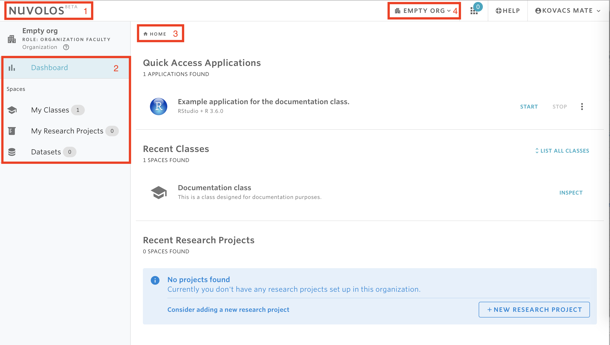

# Welcome to Nuvolos

Nuvolos is a powerful, cloud-native platform designed for computational research and education. It provides a seamless environment for data scientists, researchers, instructors, and students to work with data, code, and applications.

This documentation is designed to help you get started quickly, with tailored guides for your specific role. Whether you are an instructor setting up a course, a student working on an assignment, or a researcher managing a project, you will find a dedicated guide to get you up and running.

Choose your persona from our "Getting Started" guides to find a walkthrough customized for your needs.