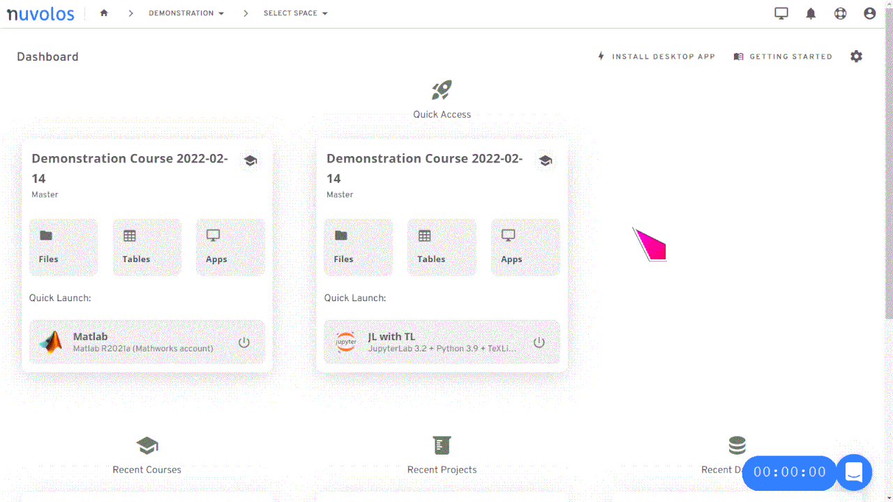
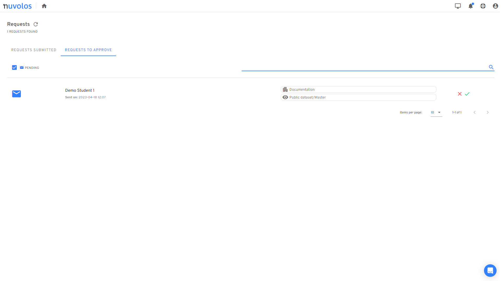

# Organisation management

This page describes the various operations involved in the management of [organisations](../getting-started/nuvolos-basic-concepts/organisational-hierarchy.md#organisations).

## Invite organisation members


* At the organization level, there are two types of permission that can be granted: organization manager and organization faculty. For details on the types of rights each of these roles has, please read our [documentation on roles](roles/).


1. &#x20;From the dashboard, click the cogwheel button on the top right and select "Organization users".\

2. Select the [type of organisation membership](roles/#organisation-level-roles) you want to invite the user with, and then provide the email(s) of the users you want to invite. Finally, click the invite button.

## Revoke organisation members


An organisation manager can 'revoke' any organisation member.

* **Revoke** will simply revoke the organisation role from the user. User accounts and instances/snapshots are not deleted. Instead, they will no longer be visible to the affected users.


To revoke or deactivate an organisation member:

1. Go to the dashboard view and, using the left sidebar, click on the users icon.
2. Identify the user(s) you want to revoke.
3. To revoke, click the black cross button.



## Review requests

Public dataset spaces in an organisation do not grant automatic access to its contents to all users. Users need to send a request to organisation management. Access is granted to the users upon the organisation manager accepting the request.

The request screen can be accessed from the top right menu:

<figure><figcaption></figcaption></figure>

Changing to the "Requests to approve" page, you can make decisions on requests.

<figure><figcaption></figcaption></figure>
