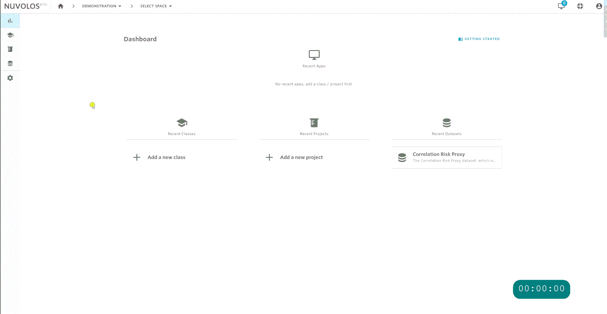

# Space management

This page describes the various operations involved in the management of [spaces](../../getting-started/nuvolos-basic-concepts/organisational-hierarchy.md#spaces).


Only organization managers and faculty members are allowed to create spaces.&#x20;


## Create a new space

1. Navigate to the dashboard view via the home icon from the breadcrumbs in the top toolbar.\

2. Decide on the type of space you want to create: course, research project, or a dataset.
   * To create a course, select courses from the left sidebar.
   * To create a research project, select research projects.
   * To create a dataset, select datasets.\

3. Assume we want to create a course. Then by clicking on the school hat icon in the sidebar, the list of courses will be displayed. From the top right, click "NEW COURSE".\

4. Provide the name of the space, select the space type, and provide a description of the space. You can also initialise the space from [GitHub ](./#clone-a-github-repository)or [another space](./#clone-an-existing-space). Once all done, click ADD SPACE. The private course is going to be called "Demo class" in this example.\

5. Once the space is created, an optional step asks you whether you want to create an application in the newly created space. To skip this step, click on "SKIP THIS STEP". In this example, we create an RStudio application with R 3.6.1 version and call it "Demo RStudio".  When done, clicking "ADD APPLICATION" takes you to the next screen.\

6. Finally, you will be redirected to a view where you can decide what to do next: add files, open the application you have just created, or invite users.

## Clone an existing space

When creating a new space, you can use the 'Clone an existing space' switch on the creation screen to select which existing space should be used as a template to the new one. The contents of the Current State of the Master instance will be cloned to the Current State of the Master instance of the new space. No access privileges, snapshots or other instances will be cloned.

Type a name for the course and a short description, then pick the resource pool to be used. Click the 'Create space based on a template' switch to activate it:

Click 'Clone an existing space' dropdown where you can look up the space to use as a template. **You need to have space administrator role in a space to select it as template.** When all the required information is entered, click the now active 'Clone space' button:


Space visibility and readme files are unavailable when a space is created based on an other. Both of these will be copied over from the template to the newly created one.


The space will be created for you immediately, however the cloning process will happen in the background. You can check its progress under User Notification/Tasks.

## Clone a GitHub repository

While creating a new space, you may choose to clone a repository hosted on Github.com. Both public and private repositories are supported.


If you want to use SSH URLs(git@...), you **need** to set up SSH access from Nuvolos to GitHub, even for cloning public repositories! To get help with setting up your SSH keys, please follow our [guide](../../faqs/faqs.md#is-git-supported).



You can choose to use an HTTPS URL, especially if you only wish to pull from a public repository. If you plan to push commits to the remote, we recommend using a SSH URLs (as the HTTPS version will ask for username & password).


To initialise the space from a GitHub repository, click the 'Create space based on a template' switch to bring up new options:

Click 'Clone a Github repository' and type or paste the URL for the repository you would like to clone.

Clicking 'Add Space' button will create the space for you, where you can add your applications as usual. Initialisation happens in the background and depending on the size of the repository it may take some time to complete. You can check its progress using the 'Tasks' entry on under 'User notifications'.

Once the cloning is finished, the repository will be available in the root directory of every application in the space.

## Delete a space


Only space administrators have the ability to delete a space. Deleting a space will remove all content in it, including all instances and data contained in all instances. \
\
**This operation might impact a large number of users.**


## **To delete a space:**

1. Open the space by selecting it from the toolbar breadcrumbs or from the dashboard. For example, let's say we want to delete a space called "Demo Space". Clicking on 'Demo Space' will take us to the overview view.
2. &#x20;From the left sidebar, hover on the settings icon and select Delete Space
3. &#x20;Read the warning message, click "I understand", and then click DELETE SPACE.

.png>)
