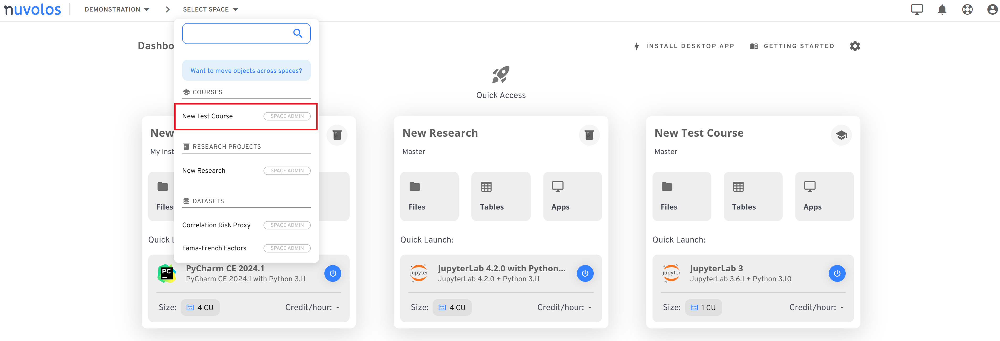

# Revoke a space user


Only a space administrator role or higher can revoke other space administrators.


#### To revoke a space administrator: 

1. Open a space. In the following example, we open the course called "Demo Space".

<figure><figcaption></figcaption></figure>

2. &#x20;Click on "Course Users" within "Manage Space" on the left sidebar.

<figure><figcaption></figcaption></figure>

3. Navigate to the "MEMBERS" tab, identify the user, and click on the cross icon next to the role field. Note that space admin roles are identified with the shield icon, editor roles have the "edit" icon, while viewer roles are associated with the "eye" icon. In the example below, we revoke the space administrator role of the user.

<figure><figcaption></figcaption></figure>

4. If revoking a space admin role, select whether you want to revoke all instance-level roles as well or not by checking the "Revoke all instance roles for this user" box.
5. Click "REVOKE".
