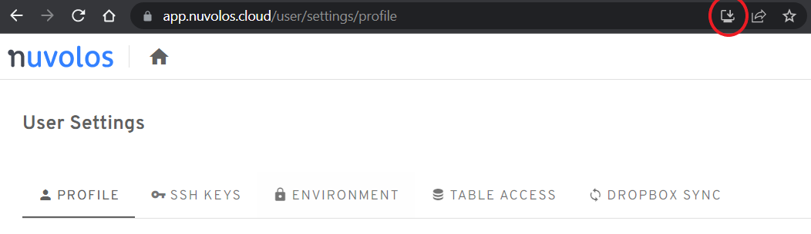

# FAQs

## How can I install the Nuvolos desktop application?

If you're using Google Chrome, you can install Nuvolos as a standalone application. This can help if you have custom browser extensions that might interfere with the web UI.

When you're logged in to Nuvolos, there is a **Install Nuvolos** button at the right side of the URL bar.&#x20;

<figure><figcaption>
The install button of the desktop application is in the URL bar
</figcaption></figure>

Afterwards, you can launch Nuvolos as a regular installed application.

## Can I use \[Software package x]?

It depends. Our applications come with the conda package manager pre-installed. You can try to install your software package via conda, see our [guide](../features/applications/install-a-software-package.md) for more details.

If the package cannot be installed via self-service, then please contact us at [**support@nuvolos.cloud**](mailto:support@nuvolos.cloud). Nuvolos supports any application that can run on Linux.

## Is git supported?

Yes, git is supported via applications. In any application you can start, **git and git-lfs is available on the command line** of your application.

Each user has their own ssh key which they can use to authenticate with git repositories. This requires two steps:

1. [Copy your Nuvolos public key](https://app.nuvolos.cloud/user/settings/ssh) and [add it to your git provider](https://docs.github.com/en/github/authenticating-to-github/connecting-to-github-with-ssh/adding-a-new-ssh-key-to-your-github-account).
2. Clone the git repository using the **SSH** protocol (make sure the repository URL starts with **git@**) and not via the https protocol.

.png>)

Now you should be able to securely pull / push code from any application, without having to enter passwords.

You can also [initialize a space from GitHub](../administration/space-management/#clone-a-github-repository) directly from the UI.

## Is Dropbox supported?

Yes, please see our [Dropbox integration guide](../features/file-system-and-storage/synchronize-with-dropbox.md).

## Is Moodle supported?

Currently we do not provide direct Moodle integration.  We are open to investigate particular integration options with Moodle, please reach out to our support if you have a particular request in mind. We plan to support Moodle and other learning management systems in the future.

## What are the limitations of the free trial?

If you don't have an account yet, you can try out Nuvolos anytime with a [free trial](https://nuvolos.cloud/go-to-free-trial). In the free trial, you'll become the Space Administrator of your sandbox space, with some pre-populated data.

While the free trial enables you to test the main features of Nuvolos, like scaling your application resources using [Credits](../pricing-and-billing/pricing-structure.md#credits), trying any apps, or inviting collaborators, certain limitations apply:

* Creation of new spaces is not allowed
* Taking snapshots is not allowed
* Distribution of apps is not allowed
* The inactivity timeout cannot be changed  (1 hour/app)
* Trial apps are stopped automatically after one hour of inactivity, even if they're actively computing
* NCU allocation settings cannot be changed (2 NCU/app)
