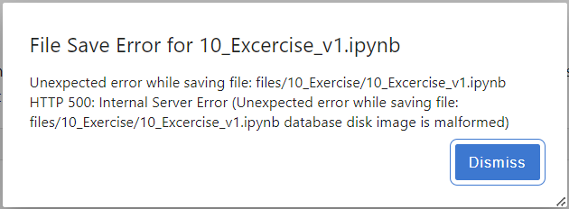

# JupyterLab 3 troubleshooting

## File save error

In rare occasions, one of the many database files used internally by JupyterLab can get corrupted, preventing the save of any changes to documents. You might see something like this on the UI:

<figure><figcaption><p>File save error: database disk image is malformed</p></figcaption></figure>

If you encounter this, try the following steps:

1. Open new terminal window, and execute `jupyter lab path`. You'll see something like\
   `Application directory: /opt/conda/share/jupyter/lab`
2. Take the directory path, and issue the following command\
   `rm <app_dir_path>/../nbsignatures.db`\
   example:\
   `rm /opt/conda/share/jupyter/lab/../nbsignatures.db`
3. Restart the application

## JupyterLab freezes when opening a specific file

Corrupted files can cause crashes in JupyterLab when opened for viewing. This can create a vicious circle:&#x20;

1. You open the file, and the entire UI freezes
2. You restart the application, but JupyterLab tries to open the same file again upon loading, and the UI freezes again

To solve the issue, rename the problematic file in the [Nuvolos File navigator](../../../features/file-system-and-storage/file-navigator.md) and restart the application. As JupyterLab won't be able to find the file anymore, the UI will not freeze.

## Running a Flask application and serving it to JupyterLab

You are able to run a Flask webserver application and make it visible in JupyterLab.

Components you need:

* Install `nodejs` from conda
  * `nodejs` is needed for commands such as `jupyter labextension install` and `jupyter lab build`. You might need to install a specific version of `nodejs` depending on the JupyterLab version. Currently version `>=12.0.0` is required.
* Install the [jupyter-server-proxy](https://github.com/jupyterhub/jupyter-server-proxy) extension.
* Flask version `>= 2.2.0` is suggested.

Potential further useful tools:

* We suggest also looking at the [`jupyterlab_iframe`](https://pypi.org/project/jupyterlab-iframe/) extension.

### Modify your flask application code

Make sure you add the following snippet to your flask application code:

```python
from werkzeug.middleware.proxy_fix import ProxyFix
from werkzeug.middleware.dispatcher import DispatcherMiddleware
from werkzeug.wrappers import Response

# ...
# your code goes here
# ...


app.wsgi_app = DispatcherMiddleware(
     Response('Not Found', status=404),
     {'/proxy/absolute/5000': ProxyFix(app.wsgi_app)})
```

