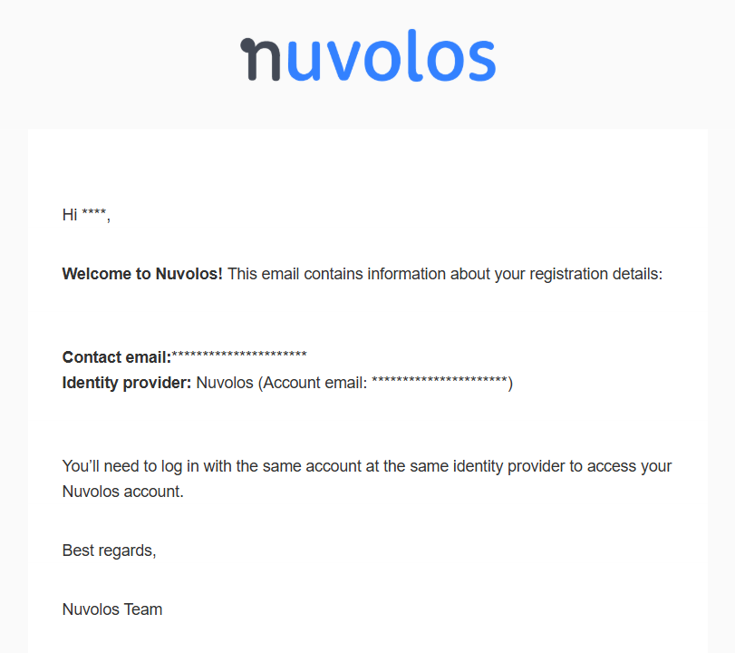

# I forgot my identity provider

## Locate welcome email

Users who registered after 2025-04-07 have received a welcome email similar to the one below:

<figure><figcaption>
Nuvolos welcome email
</figcaption></figure>

This email contains 3 important details about your account:

* The **contact email** address: used for login and every email communication on Nuvolos
* The[ Identity Provider](../../../reference/glossary.md#identity-provider): you authenticated yourself with this IdP during registration, so you'll need to use the same when logging in again
* The **account email** at the Identity Provider: It is possible that you have multiple accounts with the same IdP, for example you can have multiple Google accounts with different email addresses. So in case your email reads\
  \
  **Identity provider**: Google (Account email: myemail@google.com)\
  \
  , then it means you have used your Google account _myemail@google.com_ to create your Nuvolos account. You'll need to log in with this Google email address to access your Nuvolos account subsequently.

## Check user settings

In case you're still logged in to Nuvolos on some device, you can easily figure out your Identity provider. On the Nuvolos web UI, navigate to **User settings**, and check the **Identity provider information** box:

<figure><figcaption>
You identity provider information
</figcaption></figure>

The **Identity provider** field contains the name of the IdP. You need to use the same IdP to log in a new device. The **Account email** field contains the email _reported by your IdP for your account_.


The **Account email** is returned by your identity provider. It might not be the email address that you need to log in with on their systems, or it might be completely outdated. It is displayed for information purposes to help you identify the correct account to log in to access your Nuvolos account.

