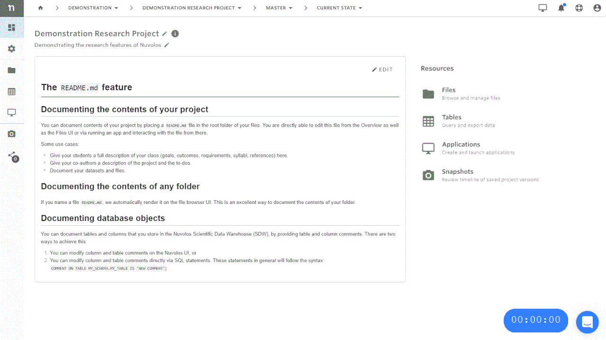
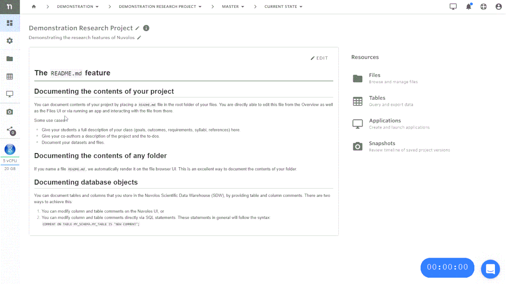
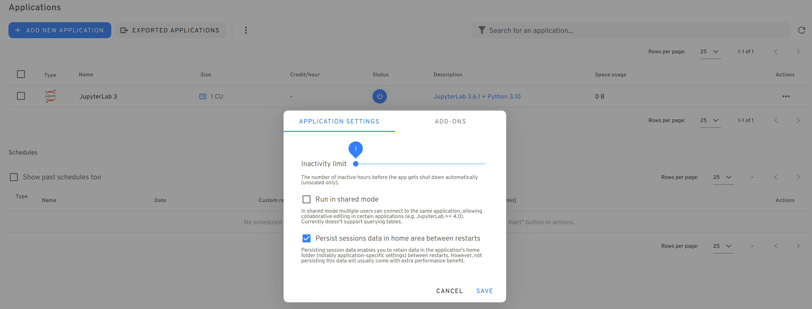

# Applications

In Nuvolos, each application is a separate entity with a separate set of resources and environmental settings. Some important considerations:

1. You can have multiple applications of the same type (e.g. RStudio) in the same instance with different sets of packages or package versions.
2. When you [take a snapshot](../../getting-started/nuvolos-basic-concepts/snapshots.md), applications are snapshotted along with all the packages and environmental files.
3. Applications can be distributed (see above).

## Create a new application

In the [research workflow guide](../../getting-started/quickstart-tutorials/research.md#create-a-new-application), we previously created an RStudio application upon creating the space itself. We will add a JupyterLab application to the Master instance of the research project.

1. Navigate to the instance overview and make sure you are viewing the current state.
2. Select the Application icon (Screen icon).
3. Click "ADD NEW APPLICATION" in the top left corner.
4. Select the type and version of the application and click "+Install". If you miss a particular application from the list available to you, please contact your organization manager or our support.

## Run an application

Visit [Work with applications](../../getting-started/researchers/work-with-applications.md) to learn how to run an application step-by-step.

## Stop an application

Stopping applications once they are not used anymore is a good practice: you stop using resources allocated to your organization.

&#x20;There are two ways to stop your application.

1. From the dashboard, or
2. from the instance overview.

### Stopping via the dashboard

On the dashboard, the three most recently used applications are always listed. Hovering over the "power button" lets you either enter the instance the app is located in, open the app directly or stop it if the app is running:

### Stopping via the application view of an instance

If you are visiting an instance, it is possible to view the list of applications on the Applications view (see previous sections) and stop a running app by opening the actions menu:

### Auto-stop for applications

Nuvolos can also automatically [stop inactive applications](long-running-applications.md).

### Persist sessions data in the home area between restarts

By default, Nuvolos applications will persist sessions data in the home between restarts, however, for a better performance, this can be disabled under the application configuration as shown below.

Not persisting the home area will allow for a better performance as the data is stored on the faster local disk, not the network storage. Also, since your home area will be reset on each restart, you don't need to worry about breaking your application configuration.

However, there is also a more stringent quota on non-persisted home areas: 2 GB is the max allowed storage footprint. Note that this quota is not a hard limit, rather a soft limit monitored regularly. If your application using a non-persistent home is found to use more than 2 GB space in the home area, it'll be restarted, thus cleaning up the home area.

## Change application resources

Applications can run in various resource configurations called sizes. Sizes with high-end resources consumes Credits, while running applications in standard sizes is included in your Nuvolos subscription.

To learn more about application resources, please consult our documentation [here](application-resources.md).
