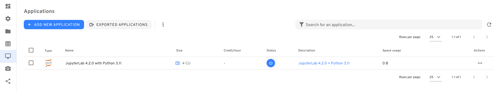
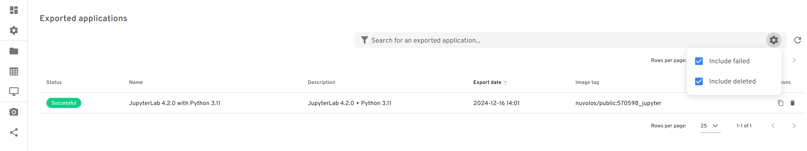

# Exporting applications

Nuvolos has a new feature for enhancing user productivity and collaboration - application exports. We believe that Nuvolos is the best place for collaborating on research projects and academic materials, yet in certain cases it is not practical to do _everything_ on Nuvolos. For example,

* students experimenting with code of an old course
* researchers sharing supporting applications for their papers
* industry experts running applications on multiple infrastructures

can benefit from Nuvolos applications exported to Docker images.&#x20;

What does this mean? Users can now export eligible applications to public Docker[^1] images hosted on [DockerHub](https://hub.docker.com/r/nuvolos/public). These can be reused on any infrastructure with the ability to run Docker containers, from desktop computers to compute clusters.


Certain Nuvolos applications have special licensing or technological restrictions that make them ineligible for exporting. If your Nuvolos application is not eligible but you believe it should be, please reach out to us on Intercom.&#x20;


## Starting the export process

For eligible apps, you'll see a new **Export application** entry for the actions dropdown.

<figure><figcaption><p>JupyterLab can be exported to a docker image</p></figcaption></figure>

Clicking on this item will bring up a dialog to pick a name for your docker image (note that you can only choose the last part of the image tag - the rest is generated by the system automatically to avoid collisions). Also, you can control if the Workspace files should be part of the docker image or not.


It is important to understand that your application will be exported to a **public** docker image hosted on DockerHub. Anyone in the world will be able to use your image without any form of authentication. For this reason, it is of paramount importance to avoid storing sensitive data in your application's library area, as it will be part of the generated image.


## Contents of an exported image

The exported image of a Nuvolos application will contain the following data:

* Your application configuration, including installed packages/extension stored in the [APP LIBRARY](configuring-applications.md#persistent-locations) area.
* [Environment variables](../environment-variables-and-secrets.md)
* A default startup command to launch the app's executable

The image may also contain the Workspace files, unless you explicitly opt out when creating the image.

The exported image **will not contain**:

* Files in your [HOME](configuring-applications.md#persistent-locations) area
* [Environment secrets](../environment-variables-and-secrets.md)
* [Application addons](add-ons/)

## Managing exports

You can review all exported applications in a given instance by clicking on the exports button next to the **Add new application** button on the applications screen:

<figure><figcaption><p>The exports button is at the top left, next to the Add new application button</p></figcaption></figure>

In the exported environments screen, you can review all your exported images and delete them if you don't want them to be accessible anymore.

<figure><figcaption><p>By default all exports are shown, but failed and deleted entries can be filtered out</p></figcaption></figure>

## Running the exported image

Nuvolos exports applications to standard docker images. On machines with a docker runtime and internet access, you can use the start command provided in the actions column on the exports screen:\


<figure><figcaption><p>You can copy the run command to clipboard with the button in the actions column</p></figcaption></figure>

The command will look like this:

```
docker run -p 8888:8888 ...
```

If the image is not yet present locally, the above command will automatically pull it from DockerHub and run it. You can access your application by connecting to port 8888 on your machine:

```
http://localhost:8888
```

## Archiving your image

You might want to back up or archive your images somewhere else other than DockerHub. We recommend pulling the image using docker then save it as an archive:

```
docker pull ...
docker save ... | gzip > my_archive.tar.gz
```

The archived image can be loaded back using the load command:

```
docker load < my_archive.tar.gz
```

[^1]: Docker and the Docker logo are trademarks or registered trademarks of Docker, Inc. in the United States and/or other countries. Docker, Inc. and other parties may also have trademark rights in other terms used herein.
