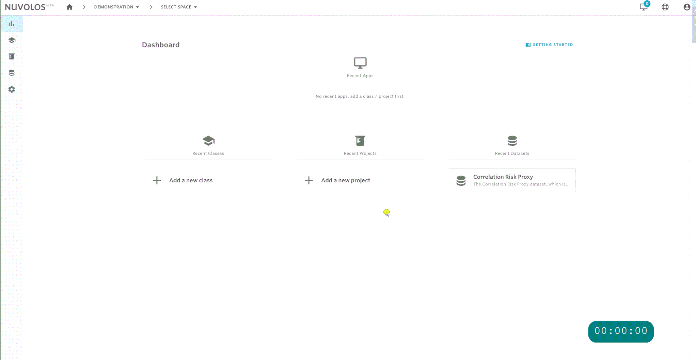
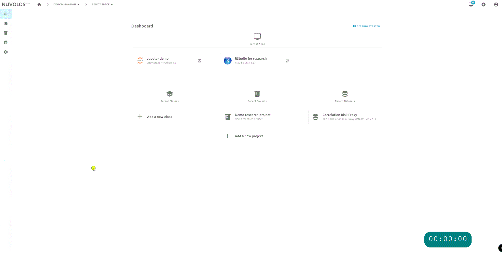

# Database integration

Nuvolos is not just an online computer lab, it is also an online data platform. We offer strong data integration to support modern research and education use cases that rely on large amounts of data.&#x20;

As a data platform, Nuvolos integrates strongly with both online (Nuvolos based) and offline (non-Nuvolos based) applications. Please review our [access documentation](access-data-from-applications/) to learn more. Nuvolos also offers the ability to define data pipelines, and ingest data from various sources. Please reach out to our [support](mailto:support@alphacruncher.com) for more information.

In this documentation, we will regularly refer to the data platform service as the Scientific Data Warehouse (SDW). The Scientific Data Warehouse is built on the [Snowflake](http://snowflake.com) service, you can refer to the Snowflake SQL documentation [here](https://docs.snowflake.com/en/sql-reference-commands.html).

## Connection modes

Nuvolos users automatically get an account on the SDW once they have access to a space with tables enabled. Whenever you're interacting with the SDW, a connector first connects to the Snowflake service using some credentials. To follow industry best practices regarding data security, Nuvolos offers 2 connection modes for SDW accounts:

### Service mode

In this mode, connection is done based on a username and an RSA key, and connecting to the SDW is only allowed from **within Nuvolos**. Nuvolos applications receive the RSA key automatically. Consult the [internal application guides](access-data-from-applications/#accessing-data-from-applications-running-in-nuvolos) on how to work with the SDW.&#x20;

While it is highly unlikely that such an RSA key gets compromised, it is possible to rotate the RSA key in the [Table Access](https://app.nuvolos.cloud/user/settings/tables) menu. You'll need to restart running Nuvolos applications to receive the rotated key.

### User mode

In this mode, connecting to the SDW is possible from both within and outside Nuvolos. Connections are done using

1. username and an RSA key from **within Nuvolos.** Nuvolos applications receive the RSA key automatically. Consult the [internal application guides](access-data-from-applications/#accessing-data-from-applications-running-in-nuvolos) on how to work with the SDW.&#x20;
2. username and token from **outside Nuvolos**. After switching to User mode, please visit first \
   \
   [https://alphacruncher.eu-central-1.snowflakecomputing.com/console](https://alphacruncher.eu-central-1.snowflakecomputing.com/console)\
   \
   and log in with your username and access token. On this site, you'll be asked to set up multi-factor authentication (MFA) using a smartphone. From then on, you can connect to the SDW using username and access token from any connector, however connection attempts need to be approved on the MFA-linked smartphone. Consult the [external application guides](access-data-from-applications/#accessing-data-tables-from-external-non-nuvolos-applications) on how to work with the SDW.&#x20;


If you need to regularly interact with the SDW from outside Nuvolos, reach out to support@nuvolos.cloud about possible solutions.


### Change the connection mode

Every user can change their SDW connection mode anytime in the [Table Access](https://app.nuvolos.cloud/user/settings/tables) menu. By default, new users are created with Service mode, but you can change back and forth between Service and User mode.

## Start working with data

Nuvolos differentiates two types of data:

1. Tabular data stored in some database management system
2. Data stored in regular files

This page describes working with _tabular data._ For working with files, consult [our guide](../file-system-and-storage/) to the file system.


This documentation distinguishes tabular and file based data.

Tabular data refers to data stored in the Scientific Data Warehouse (SDW), a SQL compliant cloud-based data warehouse.&#x20;

File based data means data that is stored on a regular file system. This guide focuses on database-stored datasets.


## Dataset spaces

Datasets are special kinds of spaces, with the main goal of containing only tabular data and documentation related to that tabular data and potentially other descriptor files. For obtaining a full list of the datasets available to you in your current organisation, navigate to your dashboard, and pick the datasets menu.


Datasets consist of immutable [snapshots](../nuvolos-basic-concepts/snapshots.md). Datasets are to be used as sources of distribution, not to directly work in.


## Distribute data you need

Suppose that your project is called 'Demo research project' and you need two tables from the 'Correlation Risk Proxy' dataset.

Using the distribute feature, you can set your research project up with the required data:

## Work with data in your workspace

Once the distribution has completed, you will receive an e-mail to your account you registered with. If the distribution was successful, the data should be available in the instance you distributed to.

You will now be able to work with data in your workspace, without having to worry about backing up your data and causing inadvertent changes.

Please follow our detailed guides:

* The [tables view](view-tables.md) helps you explore and write basic queries against tables.
* Once the structure of data is clear, we suggest [working from applications](access-data-from-applications/) with data.
* Some [worked examples and technical guides](../../user-guides/data-guides/) demonstrate the power of Nuvolos.
