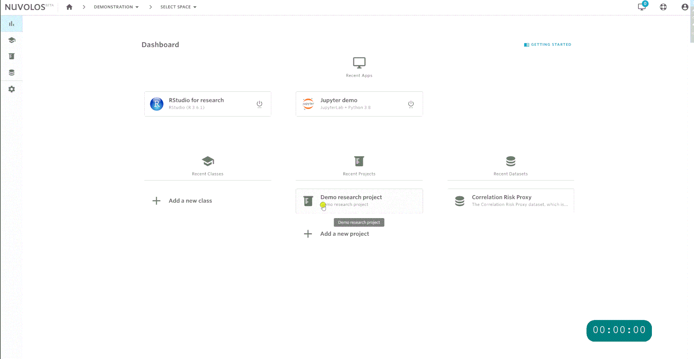
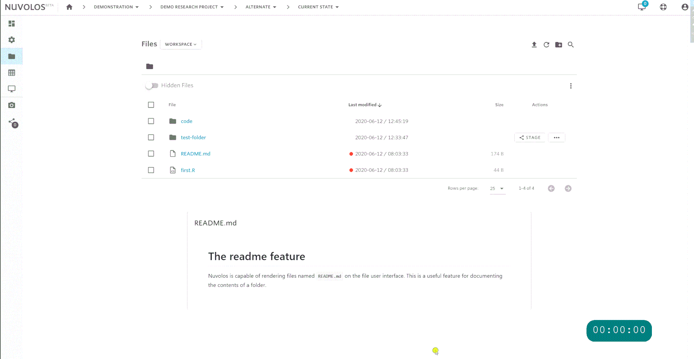
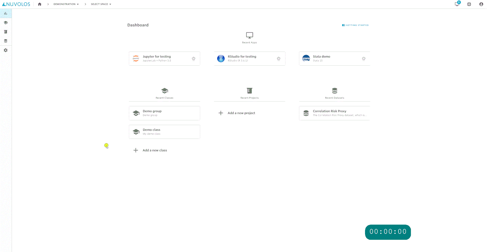
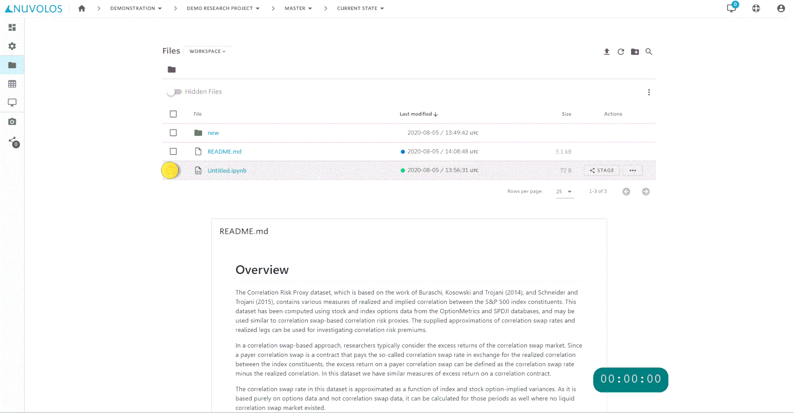
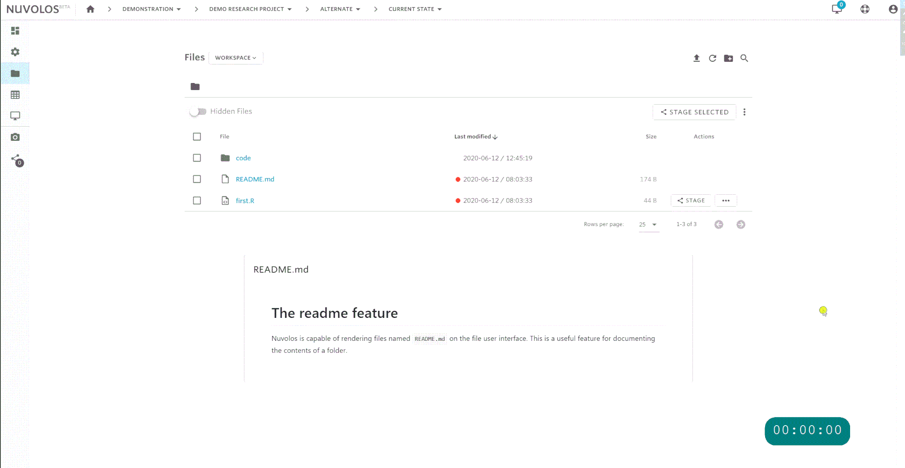
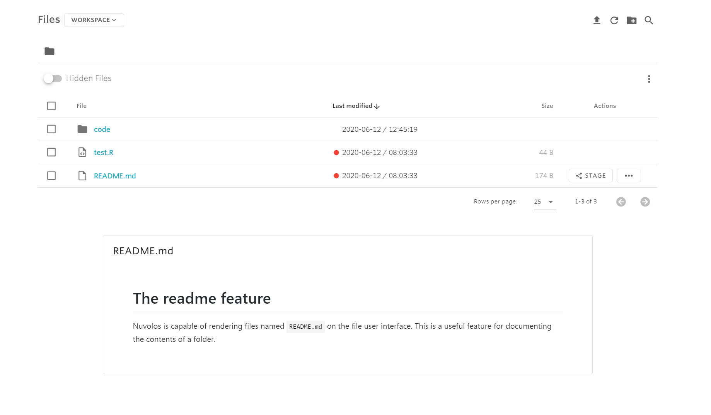

# File system and storage

## Choose your context

In all of the following operations, we assume that you know [how to pick the appropriate context for your work](../../getting-started/navigate-in-nuvolos.md) (that is, finding the current state of an instance in which you are implicitly or explicitly an editor).


Only current states can be modified - snapshots are immutable!


As an example:

## Filesystems on Nuvolos

When you work in a Nuvolos application, you naturally encounter different storage mediums that have different purposes and characteristics:

### **Ephemeral Local Storage**

Many OS files of your running application are served from a fast, but ephemeral storage. When you create [temp files](../applications/configuring-applications.md#temp-storage) in your application, these end up on this storage medium. It's fast, but limited in size to few GBs, and any changes to these files are lost on application stop (hence the name "ephemeral").

### **Nuvolos file system (NFS)**

While most of the top-level files and folders in your running application reside in the Ephemeral Local Storage, there are generally 3 folders in every Nuvolos applications which are backed by the NFS, which makes them persistent between restarts. Inside the applications, we call these folders [persistent locations](../applications/configuring-applications.md#persistent-locations), and they are exposed on the Nuvolos Web UI under the names **Workspace files, Personal files** and **Application files**.

Since these locations are persistent and can be access from multiple running applications, storage [quotas](./#quota-usage) are applied at the instance level and [total combined storage](../../administration/monitoring-resource-usage/file-system-limits-and-capacities.md) is monitored at the resource pool level. It's recommended to store data in the range of 1-100 GB in these locations.

### Large file storage (LFS)

The [large file storage](large-file-storage.md) is the persistent storage medium that can cost-efficiently support data above 100 GB sizes. Use this storage type to work with massive amounts of data.

## Nuvolos file system quota

Each Nuvolos subscription has a storage allowance on the [Nuvolos file system](./#nuvolos-file-system-nfs) that you are free to consume in as many spaces as you wish. However, to control situations with runaway storage allocation, each Nuvolos instance has a hard limit (quota) on how much data it is able to store. The only requirement is that your total combined storage usage should be in line with your subscription.

Thus, a space quota of 10 GB means that every instance in the space has 10 GB storage available.  The limits for the instances are enforced independently, e.g. a lower usage in one instance doesn't allow for higher usage in another.

## Quota usage

You can easily check the quota and your storage consumption in any instance. After navigating to the files view of the instance you are working in, look for the quota badge at the top right of the screen:

<figure><figcaption>
The badge shows the limit (quota) and the percentage used in this particular instance
</figcaption></figure>

You can click on the quota badge to bring up a detailed breakdown of your filesystem usage:

<figure><figcaption>
Detailed breakdown of filesystem usage
</figcaption></figure>

The screen breaks down the filesystem usage in the [persistent locations](../applications/configuring-applications.md#persistent-locations) of the instance:

* Workspace files are the same for all users and applications in the space, so it cannot be broken down into smaller units.&#x20;
* Personal files are displayed per user in the instance (this is the total size of Linux home folders per user in this instance)
* Application files are displayed per application (this is the total size of application libraries per application).

### Increase quota

If you're already using more than 90% of your Nuvolos filesystem quota, a banner similar to the image below might show up in the files view for **space administrators**.

<figure><figcaption>
Warning about storage filling up
</figcaption></figure>

Normally, space admins can increase the space's quota 3 times to avoid disruption of work. However, keep in mind the following constraints:

* Quota increase is only possible once you're close to exhausting it
* You cannot choose the amount of the increase, it'll be offered by the system automatically
* Every instance in the space will have the new, increased quota after you click the increase button
* If the space's resource pool is already overusing its total combined file system storage, quota increase is not allowed

Resource pool managers can [further increase the quota](../../administration/monitoring-resource-usage/#modify-instance-quota) for spaces. Reach out to your resource pool manager to get a larger storage allowance.

## Create a folder

After navigating to the files view of the instance you are working in:

## Upload files

You can upload files and folders to Nuvolos with the upload button.

You can choose to upload files from your local device, or from a publicly accessible web address. The latter is recommended for uploading large amounts of data to Nuvolos, as it is handled by a background process and once started, you may even close your browser without interrupting the upload process.


Upload from Web Address currently only support publicly available URLs, without any form of authentication.



Certain servers respond with a "Not found" page, but no error code when trying to access a non-existent asset on them. In such cases, the "Not found" page will be uploaded to Nuvolos.


In case you cannot upload a file from your local device due to it being extremely large, you can either upload it via a Web Address (if possible) or try uploading it via JupyterLab:

1. Use the upload feature in JupyterLab:

## Download files

You can download a file by selecting it and finding the download button:

.gif>)

## Delete files

You can delete one or more files by selecting them and then finding the delete button.

## Move files

You can move files around in the directory structure using the following flow:

## Copy files

You can copy a file to a different folder using the following steps:

## Rename files

You can rename a file by selecting it and finding the rename button:

## The diff feature

It is possible to view the difference of two text files in two different snapshots. In this example, we assume that there was a snapshot taken in the instance.

* An orange dot next to a filename means that the file has not been snapshot yet.
* A blue dot next to a filename means that the file has been snapshot and has been changed since the last snapshot taken.
* A green dot next to a filename means that the file has been snapshot and has not been changed since the last snapshot taken.

Hovering over the dot pops up the diff menu:

## The readme feature

If you create a file named `README.md` in a folder, the user interface of Nuvolos will try to interpret and render it as a markdown file. **The** `README.md` **created in the root directory will also be displayed on the space overview page.**

As an example:

### Link to heading

It is possible to link to headings in README.md files using standard markdown syntax, however, you need to reference the target heading with its kebab-case equivalent. To make this easier, there is a dedicated button on the web UI:

<figure><figcaption>
The "anchor" button for linking to a heading is at the right end of the menu
</figcaption></figure>

Recommended flow:

1. Copy the target heading's text to the clipboard
2. Move to the location in the document where you wish to insert the link
3. Click the anchor button, and enter the display text for the link, then hit ok
4. Paste the target headng's text and hit ok
5. Now you have a working link. You can use the visual editor to update the display text anytime

<figure><figcaption>
Linking to headings are done with standard markdown syntax
</figcaption></figure>


You can do this in _every folder_ if you want to - this is a great way to document contents of folders beyond the usual filename information you can provide yourself!

