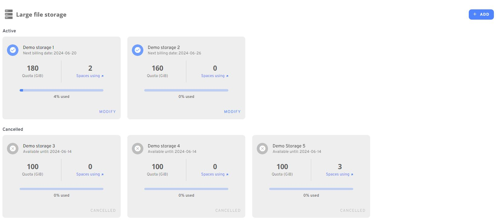
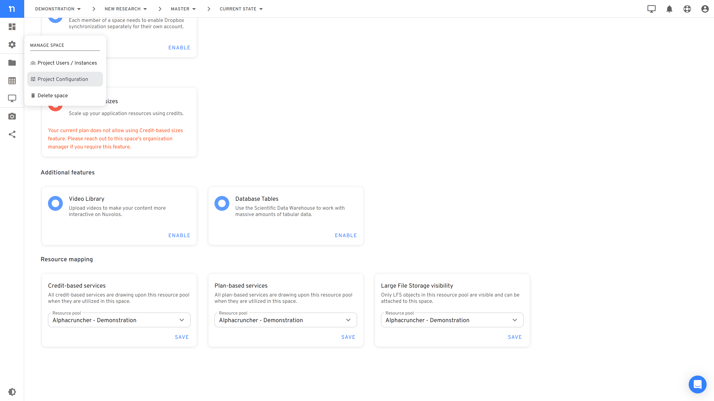
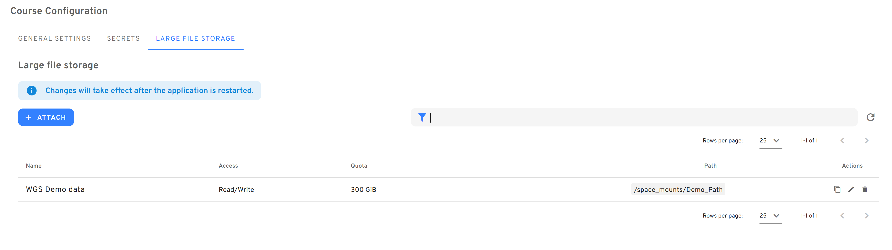

# Large File Storage

We offer a large file storage option as part of our on-demand services portfolio. The large file storage is the most cost-effective way to store large amounts of data on Nuvolos if you don't require the core Nuvolos features (snapshots, distribution) to work on the file storage.&#x20;

## Requirements and suggested use cases

The large file storage is a storage option optimized for storing files that:

* have a large storage footprint (> 30 GB),
* do not change frequently (e.g. not ideal for temp files due to latency),
* do not need to be snapshotted or distributed,
* do not need to be visible on the Nuvolos Web UI.

Interaction with these files is currently only possible via Nuvolos applications.

## Large File Storage management

### Billing model for large file storage

Nuvolos has a subscription model for large file storages. To use Nuvolos, you need to have a valid subscription to the platform itself, which is independent from large file storage subscriptions.&#x20;

When you purchase a large file storage, you effectively prepay a one-year rental fee in Alphacruncher Credits for the selected capacity. However, large file storages are subscription-based in the sense that rental is perpetual: the system will automatically renew your rental on the next billing date, due in 1 year, unless you explicitly cancel your storage subscription.


Renewal always happens at prices prevailing on the renewal date, which are based on 3rd party quotes of cloud storage. The system will send you multiple notification emails before the renewal date to check the expected costs.


If you cancel your storage subscription for a particular large file storage, it will not become immediately unavailable. Since you prepaid for a one year term, it will still be available until the end of the rental period. Note that we can't refund large file storage costs even if you cancel ahead of time. &#x20;


An example:

You purchased 200 GB large file storage on 2023 Aug 14. If you don't cancel this storage, it'll automatically renew on 2024 Aug 14 at the prices prevailing on that day. \
\
If you cancel the large file storage subscription on 2024 Oct 21, the storage will still be available until 2025 Aug 14, because the system has already deducted the cost for a second year on 2024 Aug 14. You will not incur any further costs on this storage, however all data it contains will be irrecoverably erased after 2025 Aug 14.


### Deletion of large file storage

Since large file storages can host critical data, it is important to understand what circumstances can lead to the deletion of the data inside a large file storage:

* **Cancelled storage subscription**\
  If you cancel your storage subscription, the data in the cancelled storage will be removed after the prepaid period has ended.&#x20;
* **Expired Nuvolos subscription**\
  If your Nuvolos subscription expires, all large files storages will be terminated after the corresponding resource pool(s) expiry date.
* **Insufficient funds**\
  If you don't have enough credits to prepay for the next period, your large file storage will be automatically deleted, if you have outstanding payments due for more than 30 days.&#x20;

### How to create a new storage

If you are a Resource Pool Manager, you can add a new Large File Storage on the Monitoring Dashboard under the **Large File Storage** item. When creating the storage, you are asked to type name for your storage, that will help you identify them later. You also need to select the size of the storage.&#x20;

<figure><figcaption>
Large File Storage is located on the Overview tab
</figcaption></figure>

<figure><figcaption>
Large file storage creation screen
</figcaption></figure>


Note, that for every storage created your Resource Pool will be charged with the amount indicated in the above shown screen. **Large File Storages are subscription-based** with one year payment frequency and no-refund policy.


### How to upgrade the storage capacity

Once a Large File Storage is created, you can either change the name that you provided when creating, or increase the size if needed. When upgrading the storage capacity, your Resource Pool will only incur the differential cost between the initial cost of storage and the cost of the upgraded storage.

Upon the upgrade of the storage capacity, the subscription is subjected to a renewal process, where the cost differential is computed accordingly. Consequently, the next billing date will be scheduled one year after the upgrade.


Example:

You purchased 200 GB large file storage on 2023 Aug 14. If you upgrade this large file storage to 250 GB on 2023 Oct 27, your resource pool will incur the price of 250 GB storage as of 2023 Oct 27 minus the pro-rated cost of the original 200 GB storage for the unused period 2023 Oct 27 - 2024 Aug 14. \
\
The next billing date for the storage becomes 2024 Oct 27.



If you wish to decrease the size of your large file storage by the next billing date, please reach out to us Intercom. Note that you'll need to remove excess data first for the decrease to be possible.


### How to cancel an existing Large File Storage

In case you do not intend to renew your storage subscription, you can cancel it until the next payment date indicated on the corresponding File Share's tile by clicking on the modify button and select the **Cancel storage** option.

<figure><figcaption>
You can cancel a storage from the Modify menu
</figcaption></figure>

<figure><figcaption>
Use the cancel storage button on the bottom left to cancel your storage subscription
</figcaption></figure>


Upon cancellation the storage will **remain accessible** for the entire period that has already been paid, but will be **irrevocably deleted along with its contents** once it expires. The expiry date is indicated on the cancelled File Shares' tile as _Available until._


## Working with Large File Storage

### Visibility of Large File Storage in spaces

Nuvolos has a natural separation of privileges in term of billing and actual consumption. Resource pool managers can purchase additional storage, which can be then consumed (attached) to spaces by space administrators. No matter how many spaces are using the storage, credit charges will always be made to the purchasing resource pool.

So how does access control work for Large File Storage?

A Large File Storage purchased in resource pool 'R' is visible (attachable) only in spaces where at least the credit-based services are mapped to resource pool 'R'. You can check the resource pool configuration of a space in the **Course/Project/Dataset Configuration** menu.

<figure><figcaption>
Resource Pool selection at the bottom shows where the credit-based and subscription-based services are mapped
</figcaption></figure>

To change these setting, you need to be a space administrator and a resource pool manager at the same time.


If you've changed the resource pool selection in your space before you created your first Large File Storage, you might need to save again your credit-based services setting for the storage to become attachable.


### Attaching Large File Storage to spaces

If your storage is created and visible to your space, you can start using it. In order to actually access the storage for read/write operations, Space Administrators need to **attach** them to a Space under the _**Course/Project configuration**_ menu, on the _**Additional Storage**_ tab.&#x20;

<figure><figcaption>
Two storages are attached in this space, which will be available under paths /space_mounts/demo_path and /space_mounts/demo_path2, respectively
</figcaption></figure>

When attaching a storage, you are requested to select one of the available File Storages that you would like to **access from all applications in the space** and to provide a folder name where the storage will be available. The folder with your chosen name will always be placed under a default folder: `/space_mounts/`.


Attaching a storage in a read only mode will result in **forbidden write operations** from all applications and all users in the space, including Space Administrators. However, Space Administrators can update the mode as well as the path.


Once attached, the storage will be available in all applications in the space after restarting them under the path that is displayed in the _Path_ column. Path updates and read only option updates also require application restart to take effect. In order to browse the files in the storage, you need to launch an application as they are not visible on the Nuvolos UI.


Although it is not forbidden to attach a storage multiple times to a space, we **strongly discourage** you to do so as you would access the same storage from multiple folders, which can easily lead to confusion.


### Detaching Large File Storages

Space Administrators can **detach File Storages** from the space on the same screen where they attach them. It is paramount to highlight that this operation **does not result in data loss** as the storage still exists, but is not available from the applications in the space. In case you need the storage, you can just attach it again and you can continue working with the data stored there as long as the storage exists. Note that attaching/detaching the storage also requires application restart to take effect.

### Usage and warnings

To reduce costs and enable collaborative work, all users in the given space **access the same files and folders in the given File Share.** This means that if a large dataset is uploaded, you do not need to distribute to make them available to the students and other coworkers as they can access the same storage on the path provided.


In case write operations are allowed, users **can** accidentally **override files and folders** created by other Instance Editors. Also beware that Large File Storage **does not support snapshot creation**, so be cautious when allowing write operations.  &#x20;



**Nuvolos tip:** Attach a file share with write operations allowed, upload the data you would like to share with the other space members, than update the mount to disable write operations to prevent accidental data loss.

