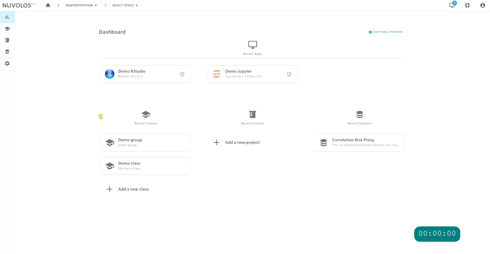

# Object distribution

Object distribution is a building-block feature of Nuvolos. The key concept to remember is that distribution is a _push-_&#x74;ype operation, you have to initiate it from the source and you send to the specified target. Consequently, you need [**EDITOR** access](../../administration/roles/#editor) on the target instance you want to write to and you need at least [**VIEWER** access](../../administration/roles/#viewer) on the source.

The following type of objects (or a combination of these) can be distributed:

* Files, sets of files, or entire directories,
* tables or sets of tables,
* applications or sets of applications,
* or entire snapshots.

## Distributing a selected list of items: a worked example

You can distribute a set of items from a single instance using the **stage** feature of Nuvolos. The stage is a temporary area for collecting objects to be distributed. Changing context (i.e. moving from a state to another) clears the stage, so to distribute to a target from multiple sources, a separate distribution needs to be initiated from each source.

Assume that you want to distribute a file and an application in the following example. In order to do this, the following steps need to be done:

1. Select the file you want to stage and either click **STAGE** or click **STAGE SELECTED** on the following screen.
2. Select the application you want to stage by navigating to the application list and staging the appropriate one.
3. Navigate to the stage area to begin distribution using the share icon on the sidebar. Observe your current set of staged objects. If everything checks out, click **CONTINUE**.  In our particular example, we have one file and one application (as selected previously) in the stage. Using the red cross button, items can be removed from the stage.
4. The next step selects the target for distribution. It is possible to remain in the current context or to distribute into some other space or even organisation. In the current example, we select a space in the same organisation. You can also choose whether to share with all instances or just one. Once you are done finding the target, click **CONTINUE**.
5. The next step selects the distribution strategy - more details can be found [here](broken-reference). For now, we will select overwrite, which will overwrite objects of the same name in the target.&#x20;


Please note that whenever you distribute, a snapshot gets created in the target, so you should not be concerned about data loss.


&#x20;Once done, click **CONTINUE.**

&#x20; 6\. Finally, you can send a message along with the distribution to notify the users in the targets about the change being made. In this particular case, we decided _not_ to notify users by emptying the checkbox.

Once you are done, click **SHARE OBJECTS** and you are done.

## Recall files

It occurs time to time that a file or folder is accidentally distributed to students that should not have been sent to them. **Space administrators** have the option to remedy the situation by deleting all copies of a distributed file or folder from all other instances using the **Delete for others** option:

.png>)

The **Delete for all** option deletes the file or folder from all instances, including Master.

Note that you must be viewing the **Master** instance in the space to have the above file deletion options displayed. In the **Distributed** and **student instances** instance, you can recall files from all current and future students via the **Delete for students** option. This will create a new snapshot in the distributed instance with the selected file(s) removed, so that future students will not get them automatically.


If you want to recall accidentally distributed files, make sure you trigger the **Delete for others/Delete for students** action **after the distribution has finished**, otherwise the deletion task might be executed before the distribution task, and hence will have no effect.

