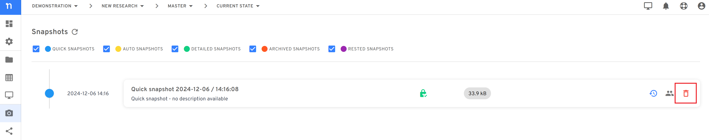

# Delete a snapshot

**To delete a snapshot:**

1. &#x20;Open a space.
2. &#x20;Go to the timeline view of snapshots, which you can do via the toolbar breadcrumbs or from the left sidebar.

3. &#x20;Identify the snapshot you want to delete.
4. &#x20;Click on the bin icon next to the snapshot name.

5. &#x20;You will be asked to confirm the operation, and if you want to proceed click on "I understand" and then "DELETE SNAPSHOT"

.png>)

#### If you are encountering a problem deleting a snapshot, refer to the troubleshooting guide [here](../../faqs/troubleshooting/administration-troubleshooting/i-cant-delete-a-space.md).
