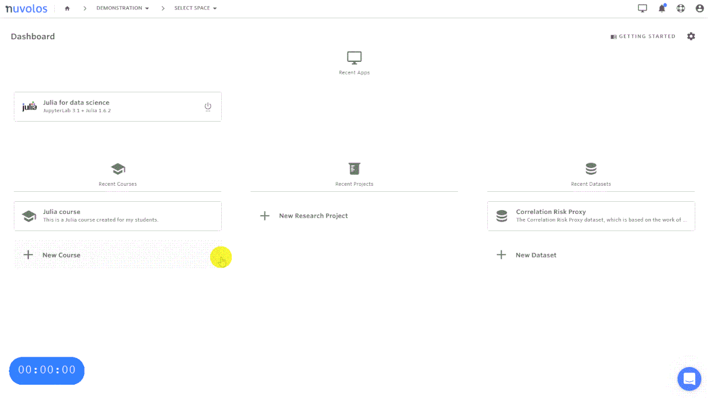

# Education (instructor)


In most cases, it is possible to set up a course from scratch in less than 5 minutes.


## Add a new course

Courses are spaces in Nuvolos where instructors add learning materials (data, code and applications) for their students. Organisation managers and faculty members may create courses.

1. Navigate to _Courses_
2. Select + NEW COURSE
3. Enter desired course name and description
4. Select + ADD SPACE
5. Select application (optional)
6. Enter desired application name
7. Select + ADD APPLICATION

