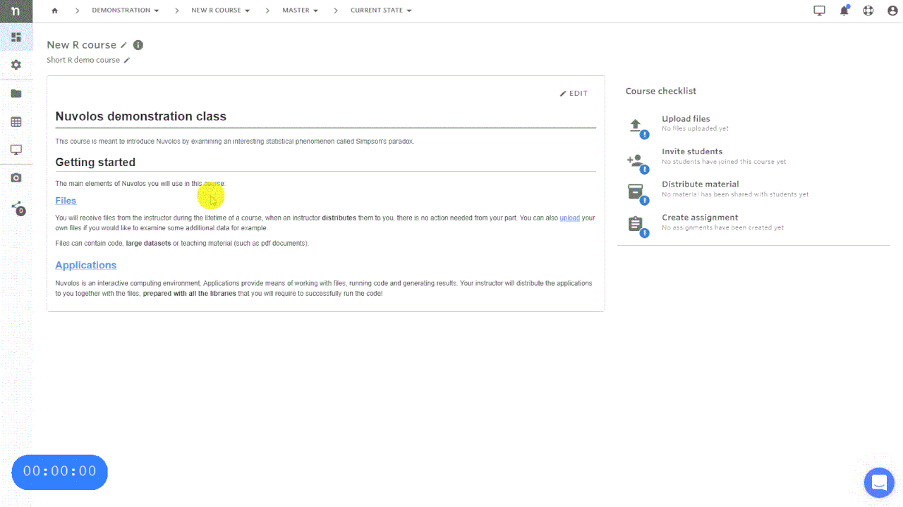

### Distribute to prospective students

You can distribute the teaching material to prospective and existing students by using the distribute feature. For a very basic use case, we demonstrate how to distribute the two files uploaded previously.

The key steps of the process:

1. **Select the objects you want to distribute**
   * Recently used applications are automatically added to the distribution, you have the option to remove them.
2. **Save a bundle**
   * You can save the list of distributed objects as a named bundle for future reference, or you can also create assignments or a learning module from them.
3. **Select the target**
   * By default, you will distribute to all students - every existing instance and future instance.
4. **Select distribution strategy**
   * By default overwrite is suggested, consult the detailed distribution documentation for other options and their use cases.
5. **Specify a notification message**
   * Your current students will receive the message you specified to their e-mail addresses.
