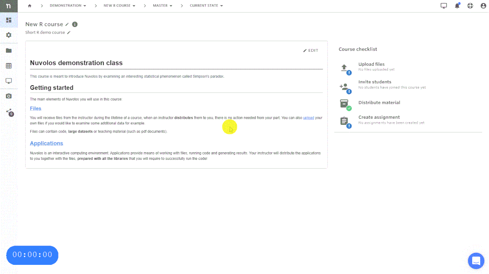

> **Prerequisite:** You must have the **Space Admin** role to perform this action. Read more about [Roles and Permissions](../../administration/roles/README.md).

## Invite teaching assistants

Teaching assistants are able to see everything that is going on in the course, they have the _space admin_ role. The user who created the course automatically becomes a _space admin_ as well. To invite teaching assistants with this elevated role, follow the instructions below.

For a more detailed guide on inviting users to a space, including administrators, please see the [Invite to a Space Guide](../../administration/space-management/invite-to-a-space.md).
