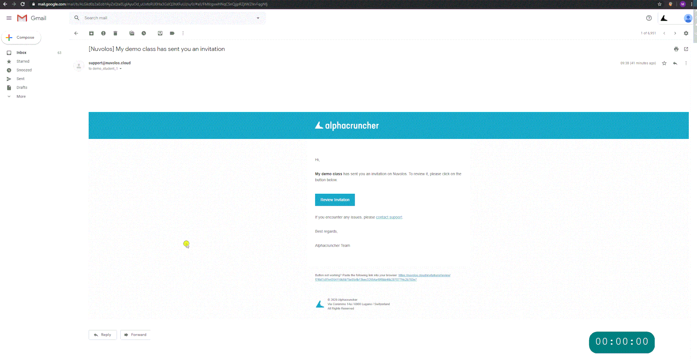

# Education (student)

## Generate invitation

If you received an invitation link directly from your instructor, you will have to either click on it or navigate to it in your browser. The invite link should look something like this: `https://nuvolos.cloud/enroll/class/4963cd4b1355488f35f874c6f9f4116e0e`

This link will take you to a sign-up page prompting you to provide your educational institution's e-mail address. Upon successfully providing the email check the invitation message in your email inbox.

## Accept your invitation

In Nuvolos, course participation is by invitation only. To accept an invitation proceed as follows:

1. Open invitation email.
2. Click **Review Invitation** in the invitation email.
3. Inspect the roles included in the invitation.
4. If you have never signed up, sign up.
5. Click accept invitation.
6. For first-time users, the signing up process might take up to a minute to conclude.


When accepting the invitation, we encourage you to proceed with the recommended option. For students affiliated with a swiss higher education institution, this is SWITCH.

If you choose to sign up with e-mail and password authentication, the SWITCH option will not be available for you anymore.


## Sign in

Nuvolos supports two ways to sign in:

1. Users affiliated with a Swiss higher education institution, select the SWITCH option.
2. Otherwise, use the default sign-in option.


If you chose to sign up with e-mail and password authentication, you need to sign in with e-mail and password, and if you chose to sign up via SWITCH, you need to sign in via SWITCH.


## Access course resources

1. Click the tile of your course on the dashboard.
   * Mind the fact that your context has changed in the breadcrumbs to your personal instance.
2. Click the file view on the overview of your personal instance.

## Download or upload material

1. Navigate to your files view.
2. There are both upload and download buttons and you can also create a folder for example for your homework.


Uploading a file to the FIle UI



Downloading a file from the file UI


## Start an application

1. Applications can be started from the dashboard directly.
2. Applications can also be accessed from the application menu of your instance overview.


Application startup will take approximately 30 to 60 seconds. For certain applications, the first startup might take longer depending on the amount of setting and package files that needs to be copied.&#x20;



Run an application from a project overview



Run an application from the main dashboard


## Snapshot your work

1. You can take a snapshot by clicking the photo camera button once you are in the context of your instance.
2. Fill out the details. If you want a faster solution, you can just create a **quick snapshot**.


Create a new snapshot of your work


## A short video guide

You can follow this video guide, once you have managed to get signed up.



