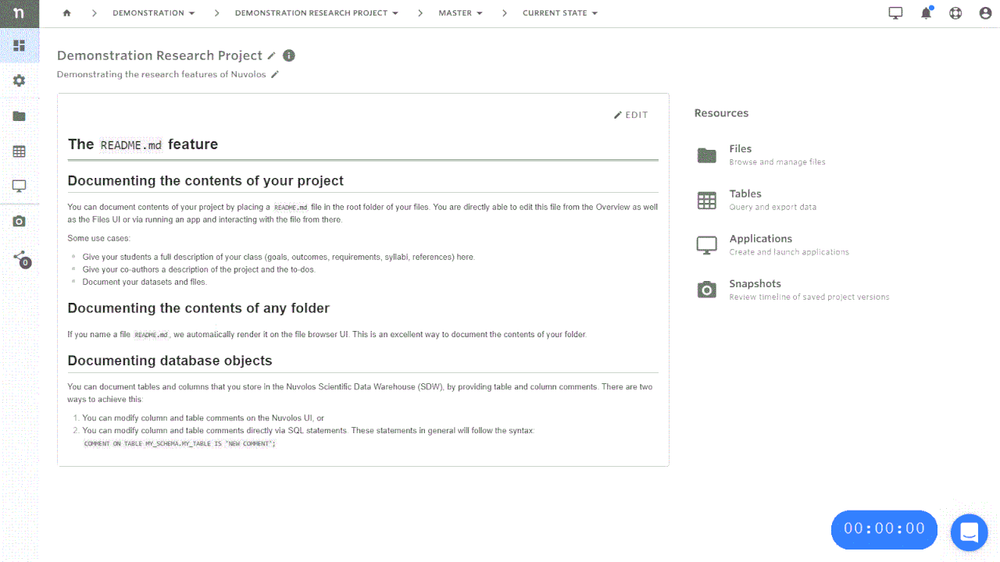
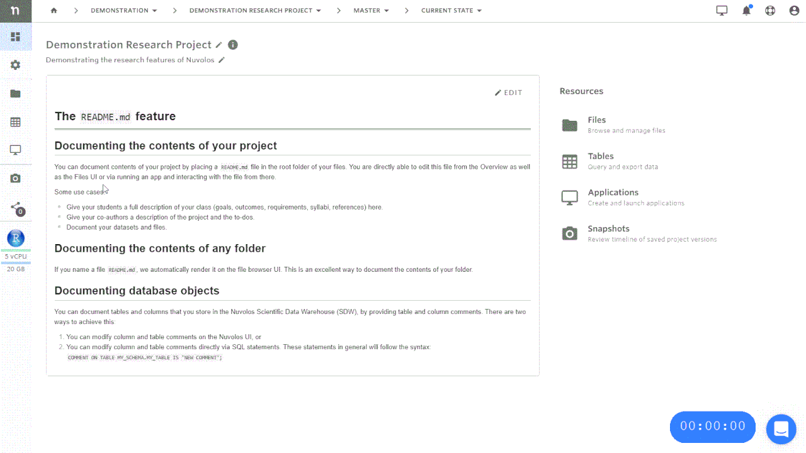

## Work with applications

For more detailed information on managing applications, see the [Applications Guide](../../features/applications/README.md).

### Create a new application

1. Navigate to the instance overview and make sure you are viewing the current state.
2. Select the Application icon (Screen icon).
3. Click "ADD NEW APPLICATION" in the top left corner.
4. Select the type and version of the application and click "+Install". If you miss a particular application from the list available to you, please contact your organization manager or our support.

### Run an application

In order to run an application, you can follow two routes:

1. Run a recent application from your dashboard.
2. Navigate to the instance of your choice and run the application directly from there.


Run an application from a project.


#### Running from dashboard

The three latest applications will appear on your dashboard. You can verify the location of the application by hovering over the start-stop button.


Running an application from the quick access menu on the dashboard


### Stop an application

Stopping applications once they are not used anymore is a good practice: you stop using resources allocated to your organization.

&#x20;There are two ways to stop your application.

1. From the dashboard, or
2. from the instance overview.

#### Stopping via the dashboard

On the dashboard, the three most recently used applications are always listed. Hovering over the "power button" lets you either enter the instance the app is located in, open the app directly or stop it if the app is running:

#### Stopping via the application view of an instance

If you are visiting an instance, it is possible to view the list of applications on the Applications view (see previous sections) and stop a running app by opening the actions menu:

