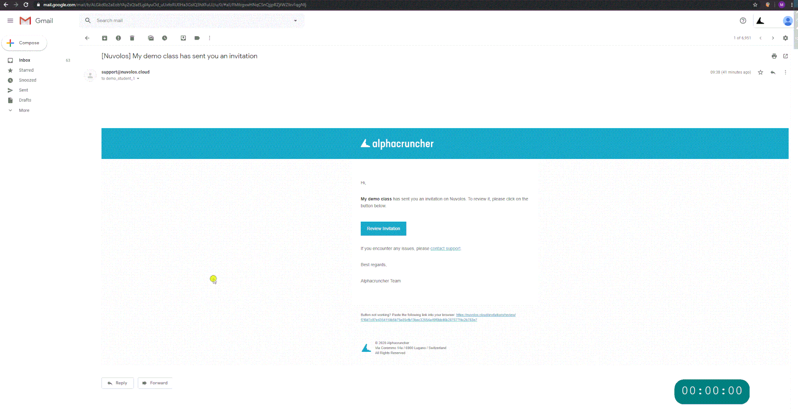

## Accept your invitation

In Nuvolos, course participation is by invitation only. To accept an invitation proceed as follows:

1. Open invitation email.
2. Click **Review Invitation** in the invitation email.
3. Inspect the roles included in the invitation.
4. If you have never signed up, sign up.
5. Click accept invitation.
6. For first-time users, the signing up process might take up to a minute to conclude.


When accepting the invitation, we encourage you to proceed with the recommended option. For students affiliated with a swiss higher education institution, this is SWITCH.

If you choose to sign up with e-mail and password authentication, the SWITCH option will not be available for you anymore.


