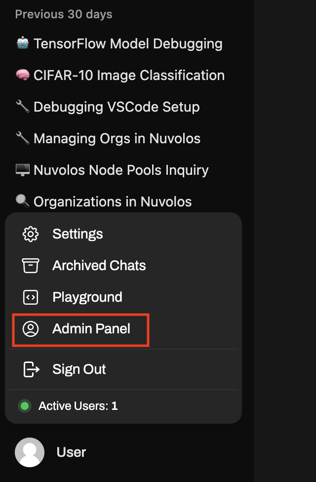
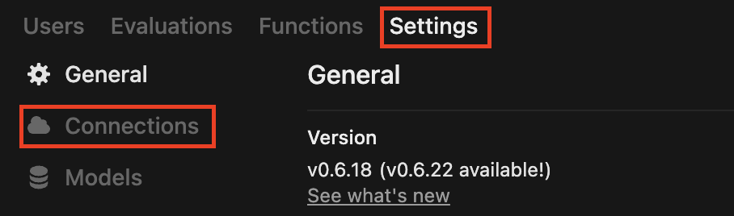
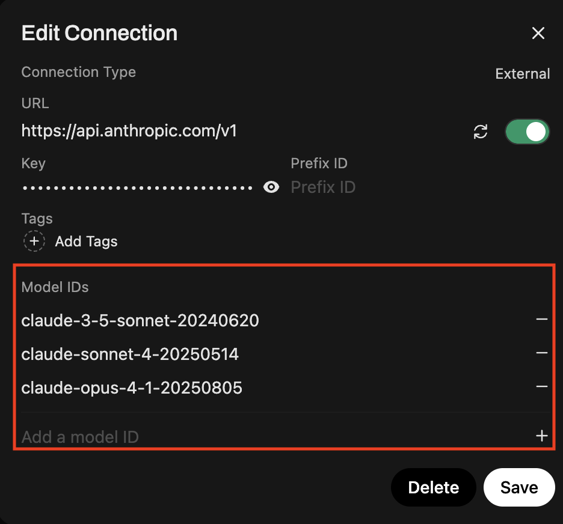
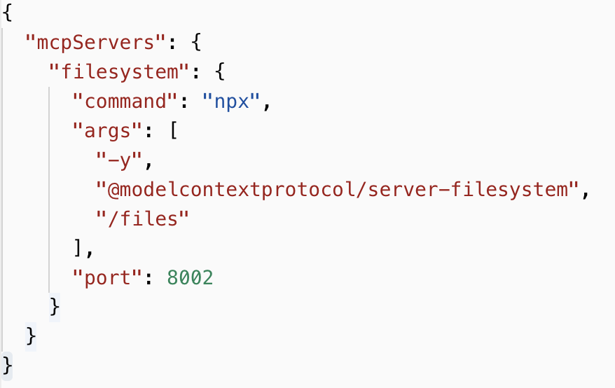
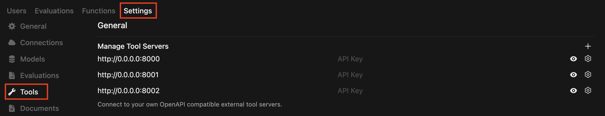
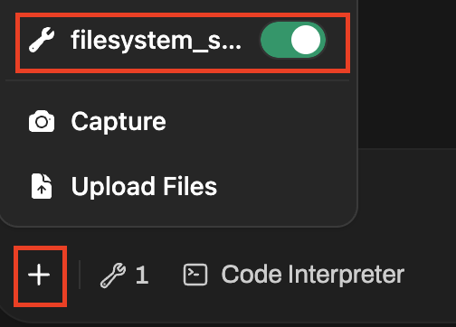
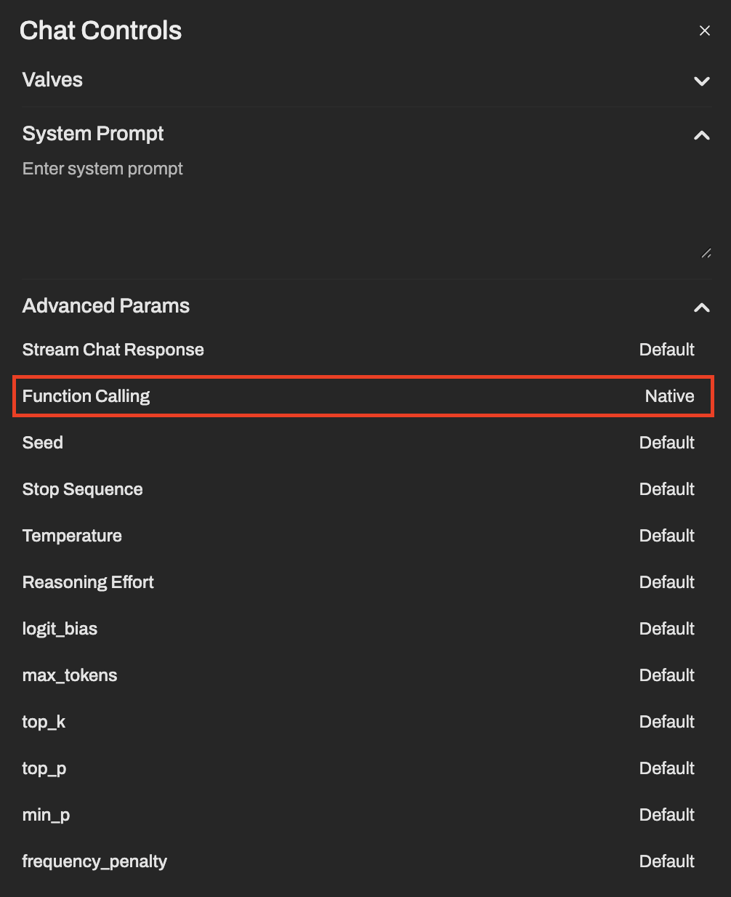
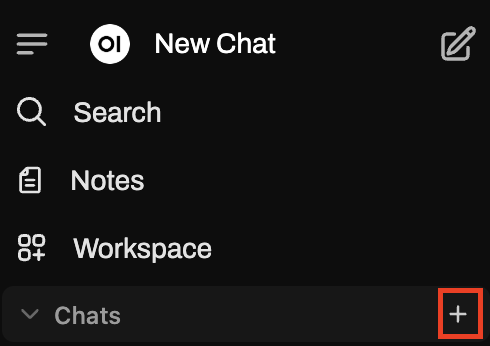
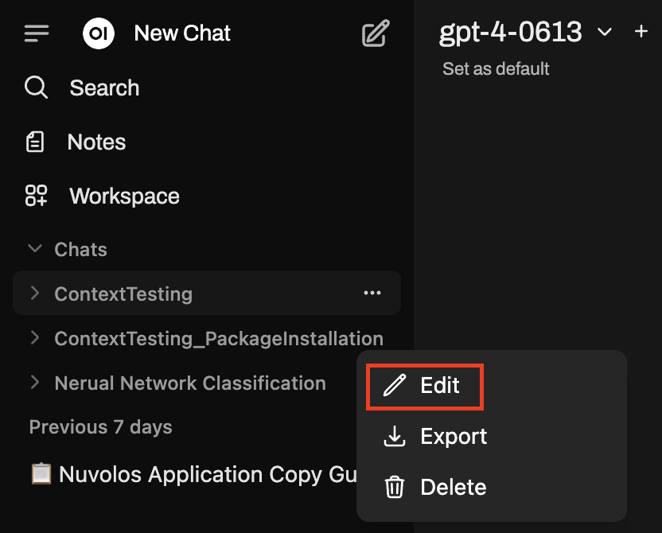
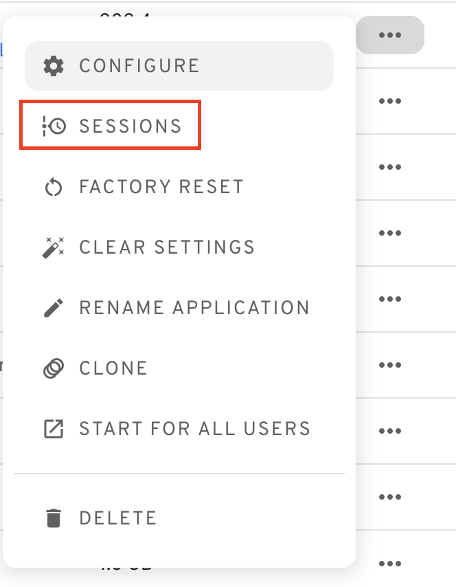

# Open WebUI

[Open WebUI](https://docs.openwebui.com/) is an extensible, feature-rich, and user-friendly self-hosted AI platform designed to operate entirely offline. It supports various LLM runners like Ollama and OpenAI-compatible APIs, with built-in inference engine for RAG, making it a powerful AI deployment solution.

### Open WebUI and MCP

Open WebUI is suitable for supporting [Model Context Protocol (MCP)](https://modelcontextprotocol.io/docs/getting-started/intro) which is Anthropic's popular framework for connecting AI agents to external tools. Thus, the Open WebUI application offers a user-friendly interface just like that of the web-accessable ChatGPT, Gemini...etc., but with two major advantages. First, the user can access any kind of AI model (OpenAI, Google, Anthropic...) within the same interface. Second, it can be directly connected to external sources that the user wants the agent to see.

### Setting Up Agents in Open WebUI

AI agents can be set up via API keys. For this one has to open the Open WebUI app, click on "User" on the bottom left corner and select "Admin Panel".

<figure><figcaption></figcaption></figure>

Within this panel one has to go over the "Settings" and select the "Connections" page.&#x20;

<figure><figcaption></figcaption></figure>

Unfortunately, Open WebUI supports only Open AI API keys currently, thus, on default only OpenAI models can be added. However, several other LLM providers (e.g. Anthropic, Google) offer OpenAI compatible API endpoints that translate their own models' messages to an Open AI interpretable format. With this other models can also be added. However, one must specify the list of models within the broader frameworks like Claude or Gemini by adding them as "Model IDs". This is not required though when using Open AI models.

<figure><figcaption></figcaption></figure>

The specific models can be selected from the LLM providers' sites.\
**Anthropic:**\
[https://docs.anthropic.com/en/docs/about-claude/models/overview](https://docs.anthropic.com/en/docs/about-claude/models/overview)

Google Gemini:\
[https://ai.google.dev/gemini-api/docs/models](https://ai.google.dev/gemini-api/docs/models)

### Setting Up MCP Servers in Open WebUI

Adding MCP servers to Open WebUI consists of two steps.

1. First, a JSON file has to be created defining the MCP servers, the path to their source codes, the packages they require and (optionally) the port on which they can be connected to. When Open WebUI launches, a manually written script automatically processes this JSON file to configure the servers. This means that if the user wanted to use another JSON file the script would have to be modified as well accordingly.

<figure><figcaption></figcaption></figure>

2. Second, the servers need to be set as "tools" on the "Tools" page of the settings.
   1. a URL must be given defining the port (must be the same as in the JSON) in a format like "http://0.0.0.0:8002" --> this tells Open WebUI to look for this tool on port 8000.
   2. a "Name" must be given to the tool, ideally a telling one.
   3. "Visibility" has to be set to "Public"

<figure><figcaption></figcaption></figure>

<figure><figcaption></figcaption></figure>

### Using Open WebUI

#### Turning on Tools

Tools (MCP servers) can be turned on and off for each chat so one can select which MCP servers to use for the given conversation. This can be done by clicking to the "+" sign at the bottom left corner of the chat window and selecting the desired tools. The feature comes especially handy if there is an overlap between servers' functions,  "tools".&#x20;

<figure><figcaption></figcaption></figure>

It is important to notice that agents will use the tools efficiently only when 'Function Calling" is set to "Native" in the Chat Controls for the given chat. This panel is accessable next to your profile icon in the top right corner.

<figure><figcaption></figcaption></figure>

#### System Prompts

System prompts are textual contexts influencing the agents' behaviour. In Open WebUI chats can be organised into folders. For each of these folders a unique system prompt can be given defining behaviour of agents acting in any of the chats under the folder.&#x20;

<figure><figcaption></figcaption></figure>

<figure><figcaption></figcaption></figure>

### Error Handling, Debugging

In case Open WebUI fails to connect to the MCP servers, or set up the agents properly the app's log messages can help in figuring out the root cause. They can be accessed via "Sessions" and "SEE LOGS".

<figure><figcaption></figcaption></figure>
