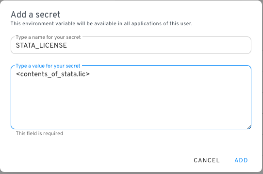

# Stata

## Profile.do files

Stata is configured with a `sysprofile.do` file, which loads the Nuvolos database connection string into the global macro `conn_str`.&#x20;

You might also want to specify your own startup Stata commands. This can be done by creating a do file under `~/ado/personal/profile.do`. The folder \~/ado/personal does not exist by default, you will have to create it once.&#x20;

### Creating your personal folder

There are multiple ways to do this. The simplest and most time efficient one is to use Stata's interface to create the folders and then save the file:

Make sure to save the file by selecting the home icon with datahub first - this is your home folder and Stata will look for the `ado/personal` folders there.

## Installing packages

When you install new packages in Stata using `scc install ...`, by default they are installed to your PLUS directory. This directory is inside your Linux home folder, and thus not visible for other Nuvolos users.

To install packages that are accessible for other Nuvolos users, you can

* Run Stata in [Shared mode](../../features/applications/configuring-applications.md#run-in-shared-mode). In this case, every Nuvolos user will interact with the same running application which will have its own Linux home folder, so installations in PLUS will be persistent between restarts and visible to all users
* Install the package into the SITE directory by issuing the following command: `net set ado SITE` . All subsequent `scc install` commands will now install to the SITE directory until you restart Stata. Packages installed to SITE will be visible to all users running the same Stata app, even without enabling Shared mode.

## Adding your Stata license file

The applications with description "Stata XX YY with license from Nuvolos secret" are all application images which can be configured to run with a license file provided by you. These application images will only work if there is a `STATA_LICENSE` secret configured in your project. The secret can be either a personal, a space-level or an organisation-level secret.

#### Step 0: Make sure you have a working stata.lic file

Make sure you have the contents of your `stata.lic` file. This file is always located in the Stata installation directory.

* On Windows usually under `C:\Program Files\StataXX`, where XX is the version number, e.g. Stata17, Stata18, etc.
* On Linux it's usually somewhere under `/usr/local/...` - but you can always use the `which` command to locate the Stata binary, and the license file is usually located in the same folder.

Regardless of operating system, the license file is a plain text file that you can open with notepad or your favourite text editor.&#x20;

#### Step 1: Add your secret

The type of secret (personal, space-level, org-level) is a question of your license type and your personal preference.&#x20;


If multiple people in your project should use the same Stata license and your license terms allow it, it makes sense to configure a space level secret.


1. Navigate to the [secret creation](../../features/environment-variables-and-secrets.md) screen of your preference.
2. Make sure you name your secret `STATA_LICENSE`. The value of the secret should be the contents of your `stata.lic` file - copy-paste it from your favourite editor, make sure you have no trailing whitespace characters.\
   
3. Save the secret.

#### Step 2: Add the application

Make sure you [add any of the applications](../../features/nuvolos-basic-concepts/applications.md) with description "Stata XX YY with license from Nuvolos secret".

