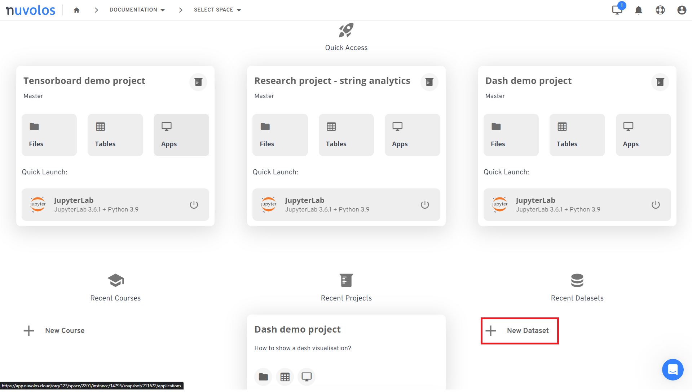
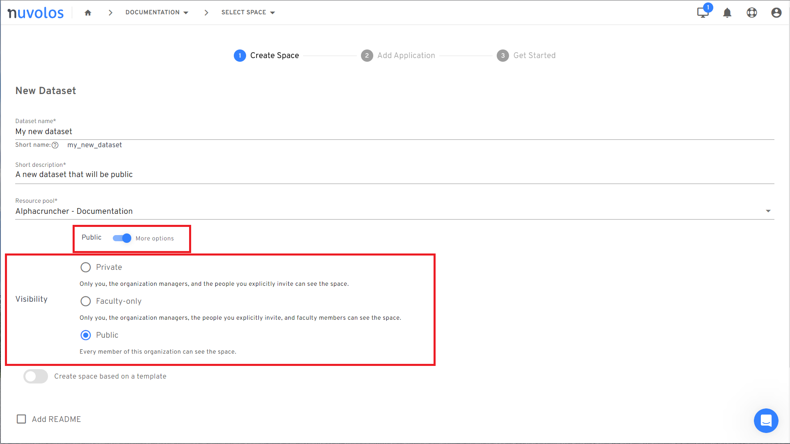

# Setting up a dataset on Nuvolos

This page explains how to create datasets with specific access control settings for your team on Nuvolos.

As a short summary, it is possible to create datasets on Nuvolos:

* That are visible to all users in an organisation,
* that are visible only to faculty users of an organisation,
* or just visible to invited users.

## 1. Setting up  a dataset space

**Required role: organization faculty**

As a first step, you need to set up a dataset space. Any organization faculty user can do this, by creating the "New dataset" space creation.

<figure><figcaption>
Create new dataset
</figcaption></figure>


Dataset spaces are special: you **cannot** run applications in them. The best way to populate a dataset space is to distribute to it.


During the creation, you have the option to set the visibility of the space:

* A private space is visible to users explicitly invited to the space (the default behaviour).
* A faculty-only space is visible to all organisation faculty users.
* A public space is visible to all users. Users still need to request access to use the data in a public space but they are made aware of the space's existence.

Notice that the visibility options can be expanded with the toggle on the space creation screen.

<figure><figcaption>
Choose visibility of the space
</figcaption></figure>

## 2. Create your dataset

**Required role: organization faculty / space administrator in existing space**

Dataset spaces hold static information. In order to generate the dataset, we suggest you set up a regular research space where you execute a data pipeline and perform analytical and transformative steps to arrive at the final state of data you want to then store.

In order to see what tools are available for data pipelines, please refer to this guide.

## 3. Distribute your data to the dataset space

**Required role: editor in appropriate instance of dataset space**

Once your pipeline is finished, the artefacts you want to store are available. Make sure to [distribute your data](../../getting-started/nuvolos-basic-concepts/distribution.md) (either tables, or files or a combination of the two) to the dataset space. You may want to distribute an app as well which contains a blueprint or a software library that facilitates interaction with your data - however the app will not be able to run in the dataset space.


If you are doing regular updates to the dataset, we suggest cleaning up the current state before distributing to make sure that the next data vintage is completely clean from previous artefacts.


## 4. Create a snapshot and name it

**Required role: editor in appropriate instance of dataset space**

Once the distribution is completed, [create a new snapshot ](../../features/snapshots/create-a-snapshot.md)of the dataset space. We generally suggest to create a named snapshot with a full description of the circumstances of the snapshot creation. Datasets generated by the Nuvolos team always name these snapshots _vintages_ to highlight the fact that the same dataset may evolve during time.

## How public datasets work

Public datasets are visible to all members of an organisation. This does not imply immediate access to the contents of the public dataset space, users are granted the "observer" role.&#x20;

In order to gain viewer access to the dataset space, users need to request access. This can be done by navigating to a public space and requesting the viewer role:

<figure><figcaption></figcaption></figure>

Once the request is submitted, the manager of the organisation needs to [review and accept the request](https://docs.nuvolos.cloud/administration/organisation-management#review-requests).
