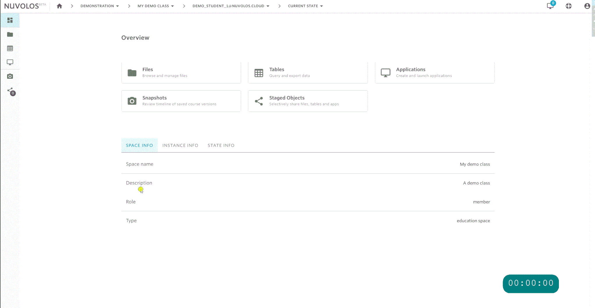

# Joining a course

## Generate invitation

If you received an invitation link directly from your instructor, you will have to either click on it or navigate to it in your browser. The invite link should look something like this: `https://nuvolos.cloud/enroll/class/4963cd4b1355488f35f874c6f9f4116e0e`

This link will take you to a sign-up page prompting you to provide your educational institution's e-mail address. Upon successfully providing the email check the invitation message in your email inbox.


When accepting the invitation, we encourage you to proceed with the recommended option. For students affiliated with a swiss higher education institution, this is SWITCH.


## Accept your invitation

Visit [accept-your-invitation.md](../../../getting-started/students/accept-your-invitation.md) to learn how to accept your invitation step-by-step.

## Sign in

Nuvolos supports two ways to sign in:

1. Users affiliated with a Swiss higher education institution, select the SWITCH option.
2. Otherwise, use the default sign-in option.


If you chose to sign up with e-mail and password authentication, you need to sign in with e-mail and password, and if you chose to sign up via SWITCH, you need to sign in via SWITCH.


## Access course resources

1. Click the tile of your course on the dashboard.
   * Mind the fact that your context has changed in the breadcrumbs to your personal instance.
2. Click the file view on the overview of your personal instance.

## Download or upload material

1. Navigate to your files view.
2. Use the upload and download buttons to get files in and out of Nuvolos. Consult the [File navigator](../../../features/file-system-and-storage/file-navigator.md) documentation about all available operations.

## Start an application

Visit [start-an-application.md](../../../getting-started/students/start-an-application.md) to learn how to start an application step-by-step.

## Snapshot your work

Visit [snapshot-your-work.md](../../../getting-started/students/snapshot-your-work.md) to learn how to create a snapshot step-by-step.

