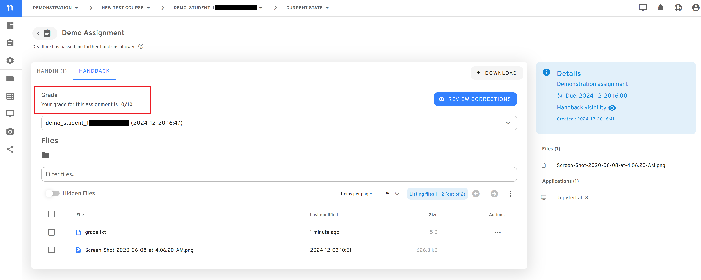

# Working on assignments

You can work on your assignments in Nuvolos, submit them directly and review the instructor's feedback without having to upload, download or send around files.

### Viewing assignments

If there is an assignment created for the course, you will be able to see it on the space overview dashboard, when you open the space.&#x20;


You can see a more detailed view of your assignments if you click on the assignment icon on the sidebar. You will be able to see the submission deadlines, whether you have submitted a hand-in for the assignments and if hand-in is still open you will be able to submit the assignment here.

.png>)

If you click on the assignment, you will be able to see the files of the assignment. These files will be distributed to you by the instructor and you can find them inside your application as regular files. From red to green, colors indicate how much time is still left to hand in solutions.

### Working on assignments

To work on assignments, you need to work on the files that are part of the assignment. Once you are satisfied with your state, make sure you saved all the files and then can proceed to hand-in the assignment.


To make submission simple, Nuvolos will hand in the files that are part of the assingment automatically. This means you cannot manually "select" files to submit in an assignment - all files part of the assignment description will be submitted automatically to the instructor.\
This means, if you worked on the material offline, you need to **make sure to move your solution to the exact same folder with the exact same name** as you received it on Nuvolos - otherwise the submission protocol will not find the file to submit.


### Handing in assignments

To hand-in an assignment, click on the assignment on the dashboard and then click on the "Hand-in" button on the top right of the dialog or open the assignment overview and on the "Hand-in" button under actions.&#x20;

When submitting your assignment, you can choose a **hand-in identifier** for your submission. This is what the instruction will see as the submission title for your submission (remember: changing the file names in the submission is not possible). If uncertain, ask your instructor how to name your submission: usually it is either your university email address, a unique university identification number or similar.

All files in the assignment **have to exist at submission time**, otherwise, your submission will fail. You can check your submission status on the tasks page (bell symbol at the top right of the Nuvolos web UI).

**You can submit multiple times** for the same assignment from the same instance until the assignment deadline has passed. The **instructor will only see your latest hand-in and will grade this version**. This is true even if you use different names for the different submissions, or if multiple users submit assignments from the same instance. One instance can have only one gradable submission (the latest one).

Once you have handed in your assignment, you will be able to see the **read-only** files listed in the handin area.&#x20;


If you wish to open the assignment from your application follow the following structure:

```
Assignments > handback > [assignment_name]> [handin_id]
```

It is recommended to check the handin area after a submission to make sure all the files have been successfully submitted with the right version. Don't worry, you cannot modify the files in the handin area, they are read-only, however you can download the files from here.


You will be able to see a list of your past submissions if you select a different submission from the dropdown menu.


### Reviewing feedback

Once the instructor has reviewed your work, they will enable you to see the hand-back version of the files. Click on the Assignment tile to open the Assignment view which will show the grade you have received under the Handback tab.&#x20;



You can also review the corrected version of your files, listed under this tab. These files are **read-only** for students; however you can download them from the Actions column. If you wish to you can also review the corrections from the application&#x20;

If you wish you can also launch the application to review the corrected version of your files (first make sure any running applications are stopped), using the "Review Corrections" button from the assignments dialog which will then show the corrections for the given assignment in the following folder:

```
Assignments > handback > [assignment_name]> [handin_id]
```


You'll only see the feedback in the handback folder if the **teacher has made handbacks available.** Only the latest handin will be graded.

