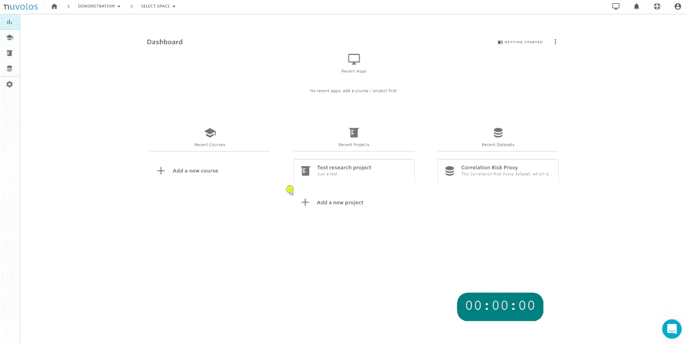

# Invite to an instance

## **Invite users to an existing instance**

In order to invite users to an existing instance, follow our visual guide:

&#x20;Step-by-step:

1. Navigate to the space where the instance you want to invite to is located. In this example, the space is called _Test Research Project_.

&#x20;   2\. From the overview screen, click on **Project Users**. For courses, this option would be named **Course users.**

&#x20;   3\. Navigate to the **Instances** tab, identify the instance you want to invite to, and click on **Invite users**. In the example below, we invite users to the instance called _Example 1_.

&#x20;   4\. Make sure you select **Option1 - User Invitation** and **Invite to an existing shared instance**.

&#x20;   5\. Select whether you want to invite instance editors or viewers.

&#x20;   5\. Provide the emails of the users you want to invite to the selected instance and finally click **Invite**.
